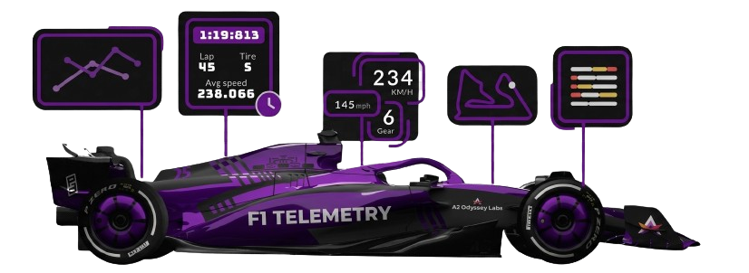

<p align="center">
  
</p>

<h1 align="center">F1-Telemetry</h1>

<p align="center">
  <strong>Interactive Formula 1, F2 &amp; F1 Academy race analytics — powered by real telemetry data.</strong>
</p>

<p align="center">
  <a href="https://f1-telemetry.matthews-world.co.uk/">🌐&nbsp;Live Site</a>&nbsp;&nbsp;·&nbsp;&nbsp;
  <a href="#features">✨&nbsp;Features</a>&nbsp;&nbsp;·&nbsp;&nbsp;
  <a href="#tech-stack">🛠&nbsp;Tech&nbsp;Stack</a>&nbsp;&nbsp;·&nbsp;&nbsp;
  <a href="#getting-started">🚀&nbsp;Getting&nbsp;Started</a>&nbsp;&nbsp;·&nbsp;&nbsp;
  <a href="#license">📄&nbsp;License</a>
</p>

---

## About

F1-Telemetry is a fork of the original [f1nsight](https://github.com/adityakotha03/F1nsight) project, refactored to **React 19** and **Vite 8** with additional features and enhancements. It's an interactive web application built for motorsport fans who want to go deeper than the broadcast — providing detailed race analytics, real-time telemetry visualisation, driver comparisons, and a 3D race viewer across **Formula 1**, **Formula 2**, and **F1 Academy**.

> **Attribution** — This project builds upon the work of the original f1nsight developers. Driver comparison data continues to be powered by the [f1nsight-api-2](https://github.com/praneeth7781/f1nsight-api-2) repository.

---

## Features

| Feature                 | Description                                                                                              |
| ----------------------- | -------------------------------------------------------------------------------------------------------- |
| **Race Leaderboards**   | Comprehensive race results with position changes, intervals and gap analysis                             |
| **Lap-Time Analysis**   | Lap-by-lap performance metrics for studying consistency and strategy                                     |
| **Tire Strategies**     | Visual breakdown of compound choices and stint lengths across the grid                                   |
| **Fastest Laps**        | Highlights of the quickest laps set during each session                                                  |
| **Pit Stop Analytics**  | Scatter-chart visualisation of pit-stop durations per driver                                             |
| **Driver Comparisons**  | Head-to-head telemetry overlays for any two drivers in a session                                         |
| **3D Telemetry Viewer** | Follow drivers around the circuit in a synchronised 3D scene with multiple broadcast-style camera angles |
| **AR Car Viewer**       | High-fidelity 3D car models with Draco / Meshopt compression (90 MB → 23 MB)                             |
| **2026 Race Calendar**  | Up-to-date schedule covering F1, F2, and F1 Academy                                                      |

---

## Tech Stack

| Layer             | Technologies                                      |
| ----------------- | ------------------------------------------------- |
| **Framework**     | React 19 · Vite 8 · React Router 7                |
| **Styling**       | Tailwind CSS 4 · Flowbite React                   |
| **3D / Graphics** | Three.js · `@google/model-viewer` · Tween.js      |
| **Data Viz**      | Recharts · D3.js                                  |
| **Animation**     | Framer Motion · Lottie                            |
| **Tooling**       | PWA (vite-plugin-pwa) · Sitemap generation · SVGR |

---

## Getting Started

### Prerequisites

- **Node.js** ≥ 18
- **npm** ≥ 9

### Install & Run

```bash
# Clone the repo
git clone https://github.com/your-username/F1nsight.git
cd F1nsight

# Install dependencies
npm install

# Start the dev server
npm run dev
```

The app will be available at **http://localhost:3006** (or the port shown in your terminal).

### Production Build

```bash
npm run build
npm run preview   # preview the production build locally
```

---

## Developer Workflow

<details>
<summary><strong>AR Model Compression</strong></summary>

Optimize `.glb` files added to `public/ArFiles/glbs/` for web delivery:

```powershell
npm run compress-models
```

Script: `scripts/robust-compress-glbs.ps1` (requires PowerShell & Node.js).

</details>

<details>
<summary><strong>Transparent Video System (Luma Key)</strong></summary>

Videos use a custom **Luma Key** pipeline for cross-browser transparency:

- Videos are encoded in a _side-by-side_ layout — **left half = RGB**, **right half = alpha mask**.
- The `LumaKeyVideo` component composites both halves onto a `<canvas>` at runtime.

**Generate a side-by-side asset from a PNG sequence:**

```powershell
& "node_modules/ffmpeg-static/ffmpeg.exe" -y -i "input_%05d.png" `
  -filter_complex "[0:v]pad=w=iw:h=ceil(ih/2)*2,split[v1][v2]; [v2]alphaextract[alpha]; [v1][alpha]hstack" `
  -c:v libx264 -crf 18 -pix_fmt yuv420p "output.mp4"
```

> The `pad` filter ensures the height is divisible by 2 for H.264 compatibility.

</details>

<details>
<summary><strong>Driver Image Background Removal</strong></summary>

Remove backgrounds from F2 driver headshots for a consistent look:

```bash
npm run remove-f2-bg
```

To process a different directory, edit the `dirs` array in `scripts/remove-backgrounds.mjs`.  
Uses `@imgly/background-removal-node` for automatic detection.

</details>

<details>
<summary><strong>Local Decoders</strong></summary>

Draco and Meshopt decoders are bundled locally in `public/decoders/` to bypass browser Tracking Prevention and ensure 100 % reliability.

</details>

---

## Deployment

F1nsight is deployed as a static site on IONOS. Key deployment notes:

1. The `.htaccess` in `public/` must be deployed at the web root to enable **Gzip compression** for `.glb` files.
2. The `public/decoders/` folder must be included in the build output to avoid cross-domain script blocking.

---

## Data Sources

This project pulls data from four sources:

- **[OpenF1 API](https://openf1.org)** — Real-time and historical telemetry, track positioning, and stint data.
- **[f1nsight-api-2](https://github.com/praneeth7781/f1nsight-api-2)** — Race results, driver standings, qualifying data, constructor stats, and head-to-head comparison analytics.
- **[f1aapi](https://ant-dot-comm.github.io/f1aapi/)** — Custom API for F1 Academy race results, driver info, and standings.
- **[f2api](https://ant-dot-comm.github.io/f2api/)** — Custom API for Formula 2 race results, driver info, and standings.

---

## Contributing

Contributions are welcome! Whether it's improving the codebase, adding features, or fixing bugs — feel free to fork the repo and open a pull request.

---

## License

This project is available under a [custom open-source license](LICENSE.md) — free for non-commercial use with attribution.

---

## Disclaimer

F1-Telemetry is an **unofficial** fan project and is not associated with Formula One companies. _F1, FORMULA ONE, FORMULA 1, F2, FORMULA 2, FIA FORMULA 2 CHAMPIONSHIP, F1 ACADEMY, FIA FORMULA ONE WORLD CHAMPIONSHIP, GRAND PRIX_, and related marks are trademarks of Formula One Licensing B.V.
